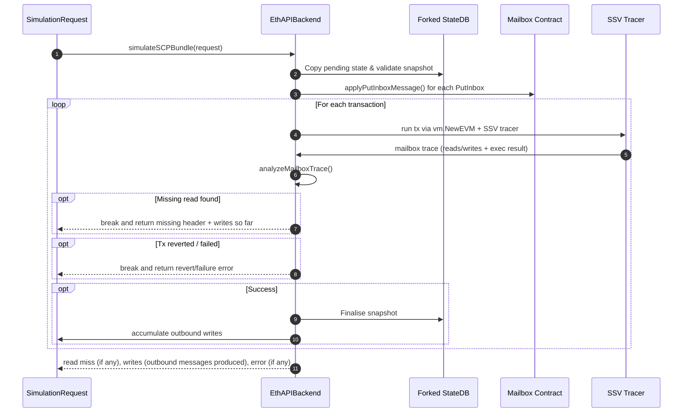

# Eth API Backend

## `simulateSCPBundle` Function

`simulateSCPBundle` is the execution-layer simulator that deterministically
executes a bundle against a copy of the current pending state, while tracing mailbox activity.
It adds inbound messages to the mailbox state,
runs each candidate transaction under the mailbox-aware tracer,
and emits simulation output:
- If there was a read miss (with the expected header).
- All outbound mailbox writes produced.
- An optional error if any transaction reverted, or something else went wrong.

### High-Level Flow

#### Key Stages

1. **Snapshot Enforcement** – The pending state root is compared with `request.Snapshot`; mismatch aborts early to avoid executing on stale data.
2. **Mailbox Replay** – Every `PutInboxMessage` becomes a locally signed `putInbox` call added to the state, ensuring that reads can be fulfilled if the data is present.
3. **Transaction Simulation** – Each payload is executed with the tracer, which records every mailbox `read`/`write` plus the EVM result.
4. **Trace Analysis** – `analyzeMailboxTrace` interprets tracer output:
   - Read msg for this chain missing? Return the header.
   - Writes targeting other chains? Bundle them.
5. **Early Exit Guarantees** - As soon as a missing read is detected the simulator rolls back the in-flight transaction, returns that header, and includes every outbound write emitted before the stall so the coordinator can forward already-produced messages.

### Test Coverage Overview

**Auxiliary Functions**

| Test | Purpose |
| --- | --- |
| `TestAnalyzeMailboxTraceReturnsMissingRead` | Ensures read calls targeting the local chain surface the expected missing header. |
| `TestAnalyzeMailboxTraceRespectsFulfilledReads` | Verifies fulfilled reads are skipped when their keys already exist. |
| `TestAnalyzeMailboxTraceCollectsWrites` | Confirms outbound mailbox writes are captured from traces. |
| `TestBuildPutInboxCalldata` | Protects the ABI encoding for `putInbox` arguments. |
| `TestBuildReadHeaderValidation` | Validates read header construction and required fields. |
| `TestBuildWriteMessageValidation` | Exercises error paths for malformed write messages. |
| `TestApplyPutInboxMessage` | Runs a real `putInbox` call to ensure the simulator mutates state correctly. |

**Mailbox Contract Cases**

| Test | Purpose |
| --- | -- |
| `TestSimulateSCPBundleWithNoTransaction` | Raises an error due to no transactions being provided. |
| `TestSimulateSCPBundleDetectsMissingRead` | Shows the simulator halts when an inbound dependency is absent. |
| `TestSimulateSCPBundleCollectsWrites` | Confirms writes from successful transactions are returned without misses. |
| `TestSimulateSCPBundleMultipleReads` | Validates only the first missing read is reported when several reads occur. |
| `TestSimulateSCPBundleMultipleWrites` | Ensures multiple writes across transactions are accumulated. |
| `TestSimulateSCPBundleDuplicateWritesError` | Asserts duplicate mailbox writes cause a revert surface to the caller. |
| `TestSimulateSCPBundlePutInboxSatisfiedRead` | Read succeeds when its inbox header was applied via `PutInboxMessages`. |
| `TestSimulateSCPBundlePutInboxDifferentRead` | Detects when PutInbox data does not satisfy the queued read. |
| `TestSimulateSCPBundleMatchedReadsRegardlessOfOrder` | Covers the three permutations of interleaving reads and PutInbox data. |
| `TestSimulateSCPBundleStopsBeforeWritesOnMissingRead` | Guarantees transactions after a missing read never mutate state. |
| `TestSimulateSCPBundleSnapshotMismatchError` | Verifies snapshot mismatches short-circuit with an error before simulation starts. |

**PingPong Contract Cases**

| Test | Purpose |
| --- | --- |
| `TestSimulateSCPBundlePingMissingPong` | PingPong ping emits a write and reports the missing `PONG` dependency. |
| `TestSimulateSCPBundlePongMissingPing` | PingPong pong halts on the missing inbound `PING`. |
| `TestSimulateSCPBundlePingSatisfiedByPutInbox` | Demonstrates a ping succeeds when its `PONG` dependency is preloaded. |
| `TestSimulateSCPBundleDuplicatePingWriteError` | Ensures a second identical ping reverts after consuming the same message. |
| `TestSimulateSCPBundlePongSatisfiedByPutInbox` | Verifies pong emits the outbound response when its read is fulfilled. |