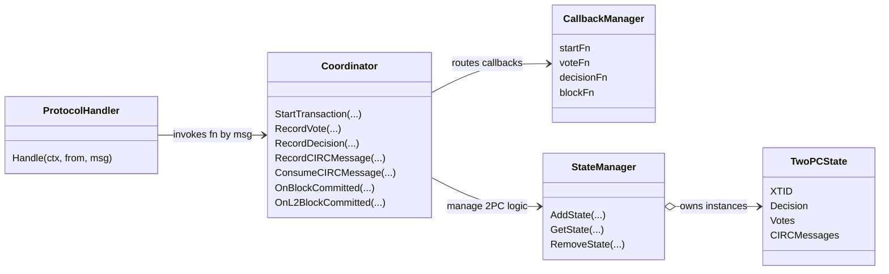

# Consensus Module

This package contains the consensus coordinator for the SCP.
It includes:
- `TwoPCState` for holding votes and decision state (NOTE: it, however, doesn't perform the 2pc decision logic, i.e. the external caller is responsible for setting the decision).
- `ProtocolHandler`: for receiving messages and routing them to the appropriate coordinator call.
- `Coordinator`: for routing calls to the callback manager (`startFn`, `voteFn`, `decisionFn`, `blockFn`) and managing the 2PC logic.
- `CallbackManager`: for managing the callback functions and invoking them with timeouts.

## Documentation



### Role
Identifies whether a coordinator instance runs as a `Follower` or `Leader`.

### DecisionState
`DecisionState` tracks the lifecycle of a 2PC transaction: `StateUndecided`, `StateCommit`, `StateAbort`.

### MessageType
`MessageType` enumerates the protobuf payloads understood by the protocol handler: `MsgXTRequest`, `MsgVote`, `MsgDecided`, and `MsgCIRCMessage`.

### Config
`Config` bundles static settings for a coordinator:
- a unique `NodeID`
- consensus `Timeout`
- `Role`

### TwoPCState
`TwoPCState` carries all data for a single cross-rollup transaction:
- `XTID`
- `Decision`
- participating chains
- collected votes (chain id -> bool)
- optional timeout `Timer`
- start timestamp
- original xt request payload
- queued CIRC messages

> [!NOTE]
> While the structure stores votes and the decision state, it doesn't implement the 2PC logic, i.e.:
> i) timeout triggers Abort decision
> ii) any vote false triggers Abort decision
> iii) all votes true triggers Commit decision
> Instead, the external caller is responsible for setting the decision via `SetDecision`.

### ProtocolHandler
`ProtocolHandler` forwards protocol messages to the appropriate coordinator method.

### Coordinator
`Coordinator` is invoked by the `ProtocolHandler.
It handles transaction start, vote/decision recording, CIRC buffering, block notifications, and lifecycle management.

It holds a `StateManager` for managing multiple `TwoPCState` instances while managing the 2PC logic, and
routes calls to the callback manager (`startFn`, `voteFn`, `decisionFn`, `blockFn`).

### StateManager
`StateManager` manages several `TwoPCState`.

### CallbackManager
`CallbackManager` stores the registered callbacks (`StartFn`, `VoteFn`, `DecisionFn`, and `BlockFn`)
and enforces timeouts when invoking them.

### Chain key helpers
Normalize chain identifiers into the hex-encoded keys used in state maps and logs.

## Tests

For running tests, use
```bash
go test -v ./...
```

- coordinator_test.go
  - `TestCoordinatorStartTransactionRegistersStateAndCallback`
  - `TestCoordinatorRecordVoteCommitTriggersDecision`
  - `TestCoordinatorRecordVoteAbort`
  - `TestCoordinatorRecordVoteRejectsUnknownParticipant`
  - `TestCoordinatorRecordCIRCMessageAndConsume`
  - `TestCoordinatorRecordDecisionFollower`
  - `TestCoordinatorRecordDecisionRejectedForLeader`
- keys_test.go
  - `TestChainKeyBytes`
  - `TestChainKeyUint64`
  - `TestChainKeyConsistency`
  - `TestChainKeyZeroSpecialCase`
  - `TestChainKeyRoundTrip`
- protocol_handler_test.go
  - `TestProtocolHandlerHandleXTRequest`
  - `TestProtocolHandlerHandleVote`
  - `TestProtocolHandlerHandleDecided`
  - `TestProtocolHandlerHandleCIRCMessage`
  - `TestProtocolHandlerHandleUnknownMessage`
  - `TestProtocolHandlerCanHandleAndName`
- state_manager_test.go
  - `TestStateManagerAddGetRemove`
  - `TestStateManagerCleanupRemovesCompletedStates`
- twopc_state_test.go
  - `TestNewTwoPCStateInitializesFields`
  - `TestTwoPCStateAddVote`
  - `TestTwoPCStateDecisionFlow`
  - `TestTwoPCStateGetVotesReturnsCopy`
  - `TestTwoPCStateGetDurationIncreases`
  - `TestTwoPCState2VotesDoesNotMeanComplete`
