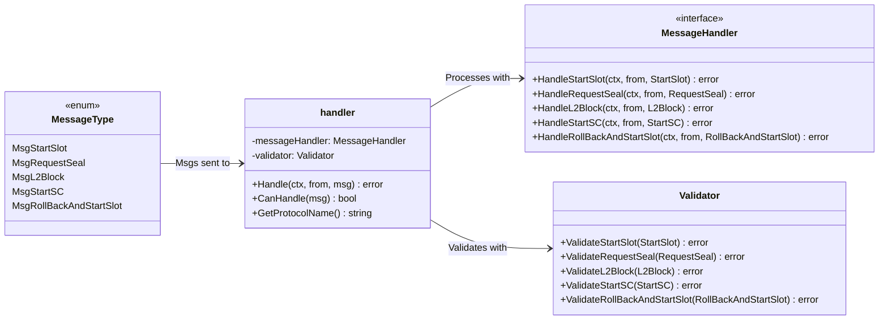

# Superblock Protocol Module

This package hands the interface for SBCP, with messages with callbacks and validation functions.

## Documentation

### MessageType (types.go)
Enum describing of the SBCP message types (start slot, request seal, L2 block submission, start SC, and rollback).

### Validator (interface and `basicValidator` implementation)
Validation functions of SBCP messages.

### MessageHandler (interface)
Holds callbacks for each SBCP message.

### Handler (interface and `handler` implementation)
Holds a validator and a message handler. Receives messages by validating and then processing them.
