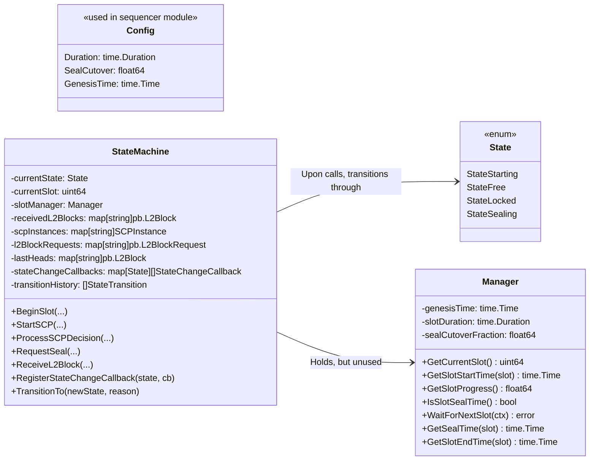

# SBCP State Transition (Slot Module)

> [!WARNING]
> Probably dead code besides `Config`.

This package models the SBCP state transitions.

## Documentation

### Config
Defines slot timing parameters: `Duration`, `SealCutover`, and optional `GenesisTime`. Default sets slot to 6 seconds.

### Manager
Holds slot timings utils.
Namely, it reports the current slot,
time remaining until seal or its end,
provides a function for waiting for the next slot,
and provides other deterministic timestamps based on genesis.

### State
Enumerates the lifecycle states: `StateStarting`, `StateFree`, `StateLocked`, and `StateSealing`

### StateChangeCallback
Observers interested in state transitions.
Whenever the state changes to `S`, the callbacks associated to `S`are invoked.

### StateTransition (state_machine.go)
Historical record describing each transition, including timestamp and human-readable reason. The state machine maintains these entries for diagnostics.

### StateMachine

Manages the state progress throughout the slot. Holds funcions such as:
- `BeginSlot`: resetting the state for the next slot.
- `StartSCP`: updating the state with the new instance, if free.
- `ProcessSCPDecision`: switching to the `StateLocked` state.
- `RequestSeal`: sets it to sealing state.
- `ReceiveL2Blocks`: updates local state with new blocks.

Also holds a general `TransitionTo` function, which triggers the callbacks for that state, for external callers to invoke.

### SCPInstance
Metadata about an SCP instanced with XT identifier, slot, participants, vote map, and decision.
